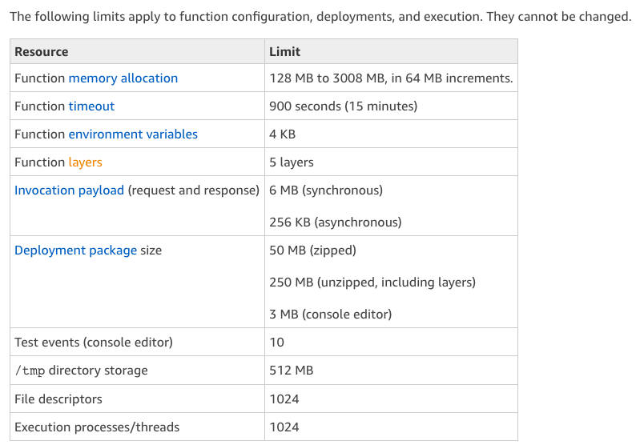

<!--
title: 'Running Puppeteer on AWS Lambda'
description: 'This example shows you how to run Puppeteer on AWS Lambda'
framework: v1
platform: AWS
language: nodeJS
authorLink: 'https://github.com/emaildano'
authorName: 'Daniel Olson'
authorAvatar: 'https://avatars3.githubusercontent.com/u/1872327?v=4&s=140'
-->

### Running Puppeteer on AWS Lambda Using Serverless Framework

### Instructions to run locally 

```
$ npm install 
$ sls offline 
```

### To Deploy on AWS 

- Add your profile in `serverless.yml` and run

```
$ sls deploy
```
___________
# About Project 

When it comes to AWS Lambda function , they have their own limits as follows

So , When you try to use Puppeteer your deployment package size(unzipped)  easily go's above 250 mb because When you install Puppeteer, it downloads a recent version of Chromium (~170MB Mac, ~282MB Linux, ~280MB Win) that is guaranteed to work with the API.

## Solution 

Best solution I found for this problem is using this awesome Serverless-framework Headless Chrome Plugin i.e 
`serverless-plugin-chrome`

# How ??

## 1. Add the Plugin in your serverless.yml

```
plugins:
  - serverless-plugin-chrome
```

## 2. Install Following Dependencies 

- superagent 
- @serverless-chrome/lambda 
- puppeteer 

```
 $ npm i superagent @serverless-chrome/lambda puppeteer 
```

## 3.Exclude Chromium Dist that comes with puppeteer by default

We can do this in package section of our `serverless.yml`

```
package:
  exclude:
    - node_modules/puppeteer/.local-chromium/**
```


## 4. Create a new file and name it chrome-script.js

Add the following lines to chrome-script.js

```
const launchChrome = require  ("@serverless-chrome/lambda");
const request = require  ("superagent");

module.exports.getChrome = async () => {
  const chrome = await launchChrome();

  const response = await request
    .get(`${chrome.url}/json/version`)
    .set("Content-Type", "application/json");

  const endpoint = response.body.webSocketDebuggerUrl;

  return {
    endpoint,
    instance: chrome
  };
};
```

`@serverless-chrome/lambda` provide scaffolding for using Headless Chrome during a serverless function invocation. Serverless Chrome takes care of building and bundling the Chrome binaries and making sure Chrome is running when your serverless function executes. In addition, this project also provides a few example services for common patterns (e.g. taking a screenshot of a page, printing to PDF, some scraping, etc.)


## 5.Connect Puppeteer With Headless Chrome

- import chrome in our `handler1.js`

```
const {getChrome} = require('./chrome-script')
```

- connect it with puppeteer 

```
  const browser = await puppeteer.connect({
    browserWSEndpoint: chrome.endpoint
  });
```

That's all you can now use puppeteer on aws lambda 


### To Test It Locally 

```
  $ npm i serverless-offline
  $ npm i chrome-launcher
```

- Make the following request (replace `{{URL}}` with the page you want to get content for)

```
curl -X GET \
  'http://localhost:3000?url={{URL}}' \
```


### To Deploy on AWS

```
  $  sls deploy
```

- Make the following request (replace `{{URL}}` with the page you want to get content for and `{{lambda_url}}` with your lambda url)

```
curl -X GET \
  '{{lambda_url}}?url={{URL}}' \
```


